# **PrinceResturant - Restaurant Booking Application**

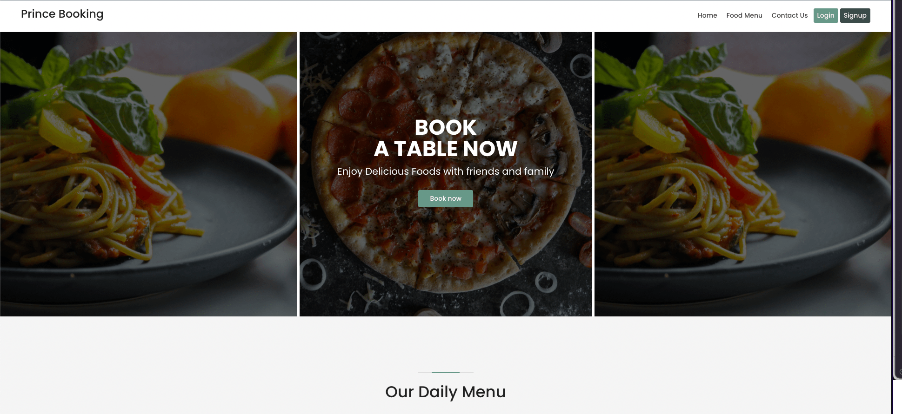

[Link to Live Project](#)

## Purpose

PrinceResturant is designed and developed to automate the booking system of the restaurant so that customer can book table online and the restaurant can grow their business.

PrinceResturant Application allows a small to medium size restaurant-business owner to extend their business to online and automate the reservation system. So that, people can know about the restaurant and see what's they are offering, besides they can also make reservations for them or their friends and family.

## Strategies

- Design and develop a reservation system to expand the restaurant business online.
- Construct a secure and comprehensive backend structure following the MVC design pattern.
- Include a SQL(relational) database to store restaurant data.
- Construct super-admin access on the system to allow make the required changes.
- Develop restaurant-admin access on the system to manage the restaurant and bookings.
- Enhance productivity and efficiency in the booking system to increase customer sales and customer retention.
- Simplify the reservation model to reduce manual work.
- Build user-friendly and intuitive UI that is responsive to ensure a better user experience.
- Handle errors in such a way that other developers can easily understand the issue.
- Allow customers to find out more information about all the services provided by the restaurant.
- Allow customers to contact the restaurant admin.
- Store contact information to the database.

## Database Schema

For this application we've used SQL database(SQLlite for development & PostgresDB for production) to store and access any associated data.

Following diagram shows the database models and the relationship between them.

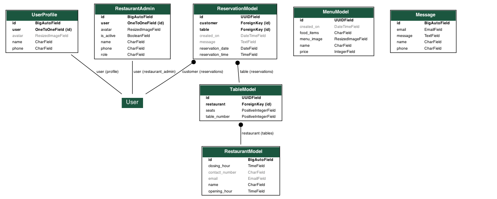

## Wireframes

Following wireframes are used during the development process.

## Features & Details

A detailed breakdown of all the features of the PrinceRestaurant Booking Application.

### Home/index Page

*URL: `{host}` or `{host}/home`*

- A dynamic navbar with 'Home', 'Contact Us', 'Food Menu' and not authenticated('Login', 'Signup') nav links.
- If a user is authenticated and not admin, the nav menu changed to 'Home', 'Contact Us', 'Food Menu', avatar(User Reservations, Update Profile, Logout).
- If a user is authenticated and admin, nav menu changed to 'Home', 'Contact Us', 'Food Menu', avatar(Admin Dashboard, User Reservations, Update Profile, Logout).
- A hero section slider of food images with a 'Book now' action button.
- Ten items of food menu with thumbnails and price.
- Food menu thumbnails have a popup view upon click.
- A section with the 'Contact Us' call to action button.
- A Footer with some information about the restaurant.
- In a smaller display, all links will be contained in a hamburger dropdown icon.

<details>
<summary>Home (View Home page)</summary>
<p align="center">

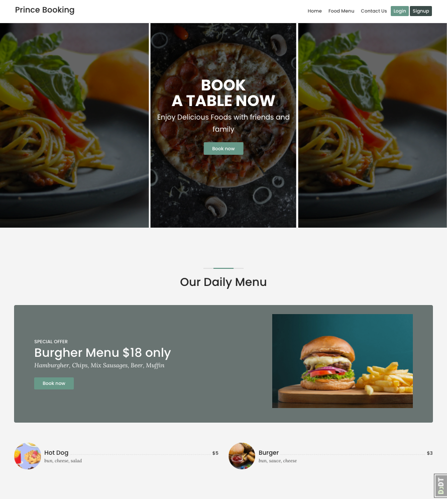
</p>
</details>


### Food Menu Page

*URL: `{host}/food-menu/all/`*

- Title section with parallax background.
- Contains offer section with 'Book Now' call to action button.
- Contains all the items on the food menu with thumbnails, ingredients, and prices.

<details>
    <summary>Food Menu (View Food Menu page)</summary>
    <p align="center">
        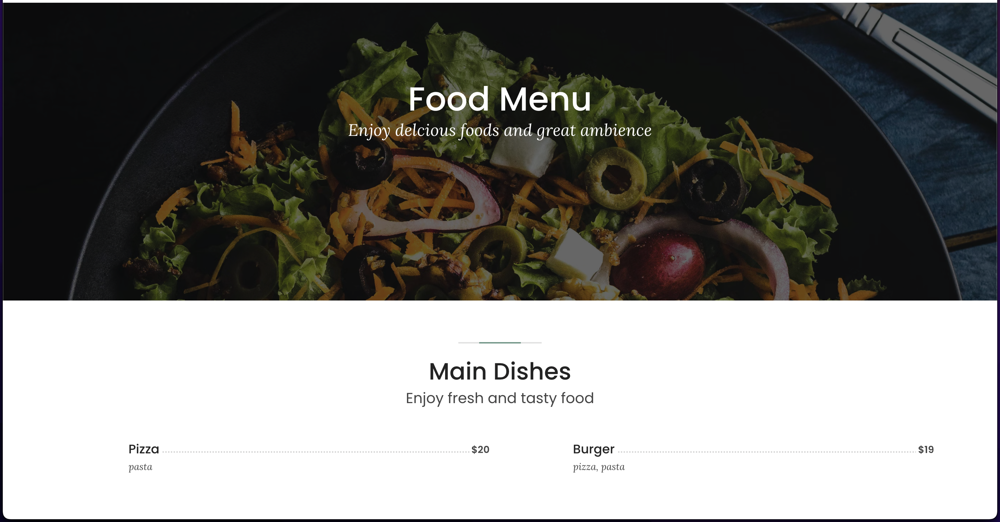
    </p>
</details>

### Login Page

*URL: `{host}/accounts/login/`*

- Login form with required fields.
- Show messages on wrong credentials.
- Redirect to requested page after succesful login.
- Contains register button on the page.

<details>
<summary>Login Menu (View Login Menu page)</summary>
<p align="center">

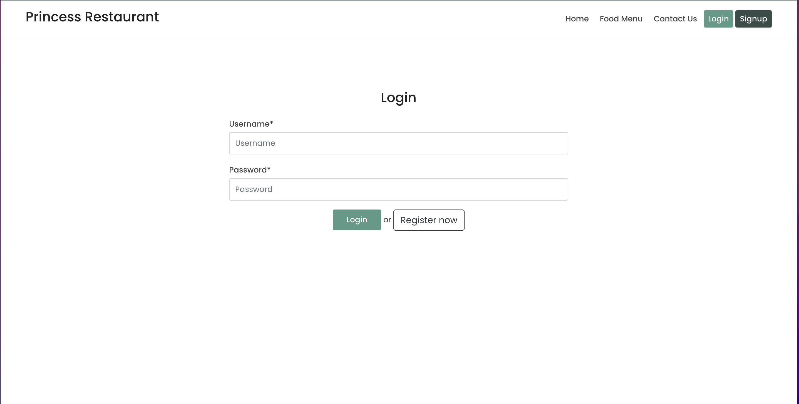
</p>
</details>

### Signup Page

*URL: `{host}/accounts/signup/`*

- Signup form with required fields.
- Show messages on wrong credentials or exists user.
- Redirect to profile update after succesful signup.
- Contains login link on the page.

<details>
<summary>Signup Menu (View Signup Menu page)</summary>
<p align="center">


</p>
</details>

### Profile Update Page

> Login requied

*URL: `{host}/profile/update/`*

- Profile Update form with fields.
- User is able to add avater and more information.
- Show messages on wrong credentials.
- Redirect to profile update after succesful submission.

<details>
<summary>Profile Update Menu (View Profile Update Menu page)</summary>
<p align="center">

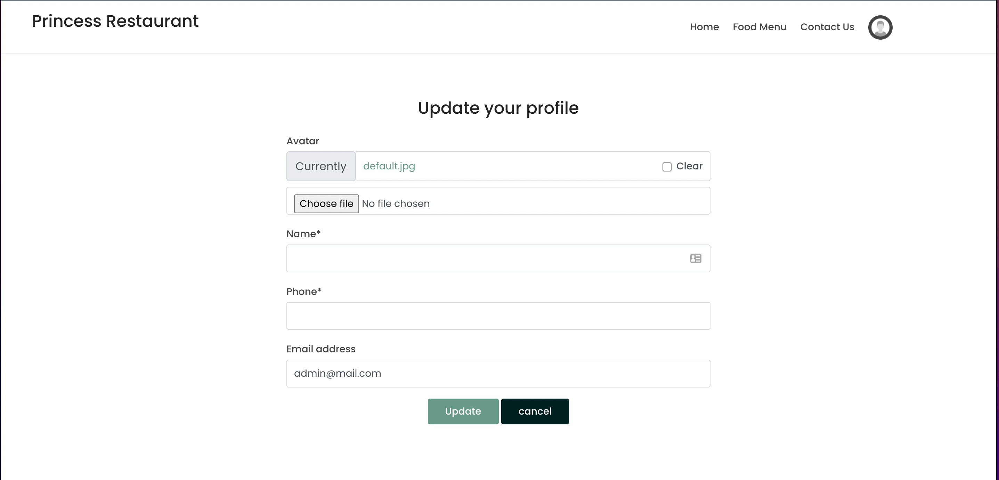
</p>
</details>

### Make Reservation Page

> Login requied

*URL: `{host}/reservations/make_a_reservation/`*

- Contains date select widget form to select a reservation date.
- Show validation error if date is not selected.
- On next contains time and table-size select widget.
- On next contains short message widget and accept T&C field(requied).
- On successfull reservation user redirect to success page.
- User can not make duplicate reservation.
- On duplicate reservation, user redirect to the same page with error message.

<details>
<summary>Make Reservation (View Make Reservation page)</summary>
<p align="center">

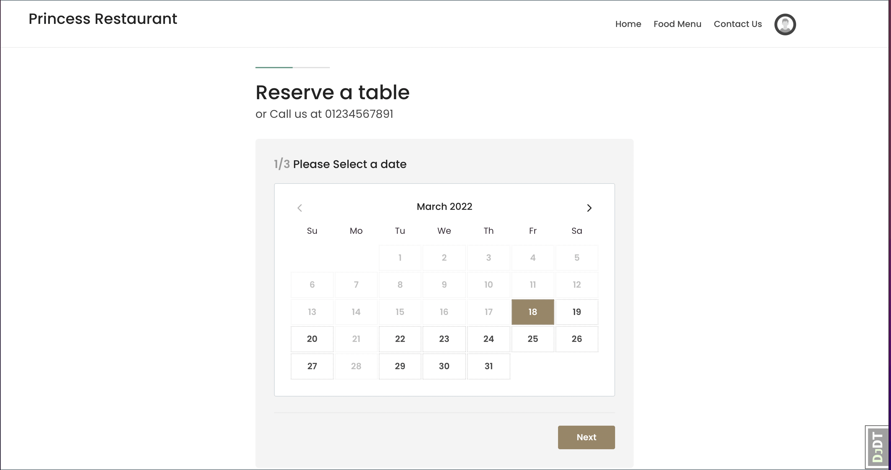
</p>
</details>

### User Reservation Page

> Login requied

*URL: `{host}/reservations/my-reservations/`*

- Contains all the successful reservations(upcoming) of the requested user.
- User can cancel their already made reservations.
- After successful cancellation user will be rediredted on the same page.
- If user has no reservation a "No reservation" message will be displayed on the page.

<details>
<summary>User Reservation (View User Reservation page)</summary>
<p align="center">

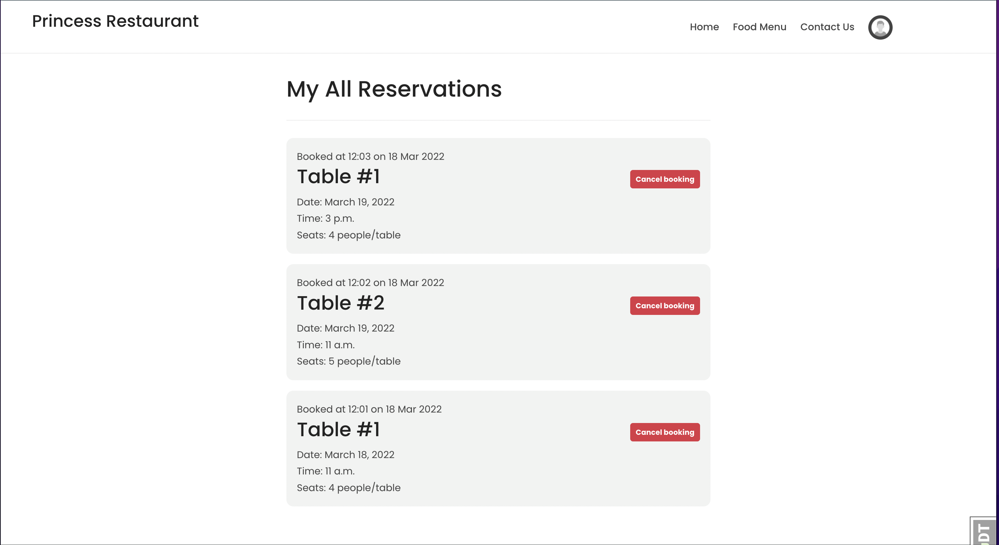
</p>
</details>

### Contact Us Page

*URL: `{host}/contact/`*

- Contains contact information of the restaurant(comes from backend).
- User can send message by filling the form.
- After successful submission user will be redirected to the same page.

<details>
<summary>Contact Us (View Contact Us page)</summary>
<p align="center">

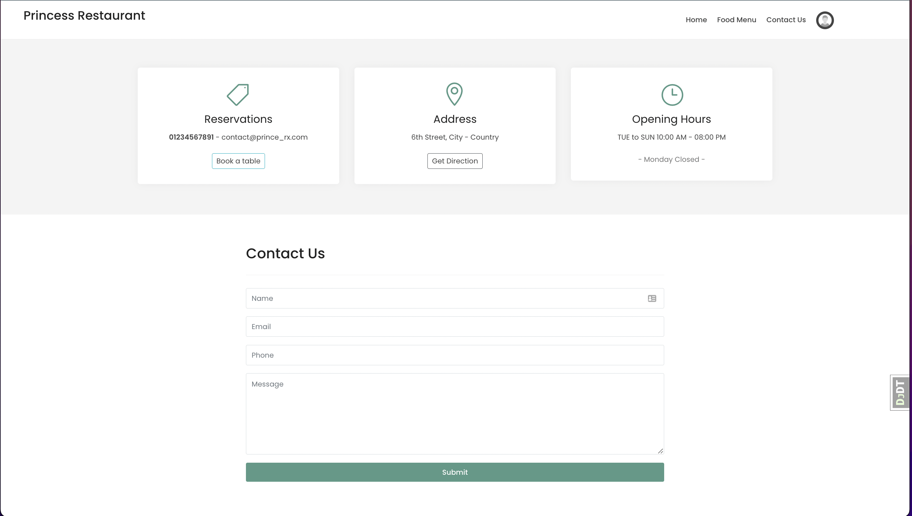
</p>
</details>

### Admin Dashboard Page

> Login requied
> User must be admin

*URL: `{host}/reservations/admin/dashboard`*

- Contains the restaurant information(comes from backend).
- Admin can update restaurant information.
- Contains all the tables with information, next reservation and action button.
- Admin can add, upade and delete table.

<details>
<summary>Admin Dashboard (View Admin Dashboard page)</summary>
<p align="center">

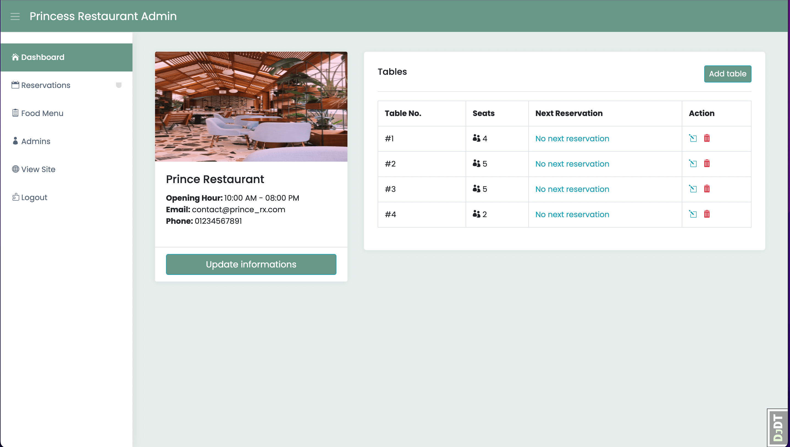
</p>
<summary>Add Table (View Add Table page)</summary>
<p align="center">

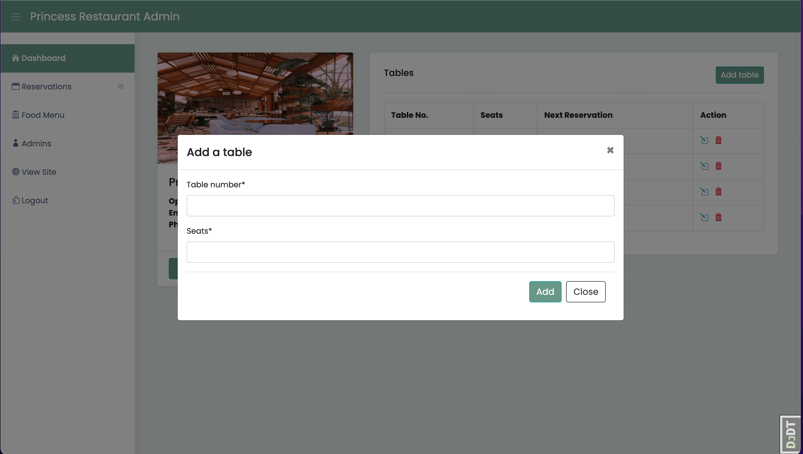
</p>
<summary>Add Table Success Message(View Success Message)</summary>
<p align="center">

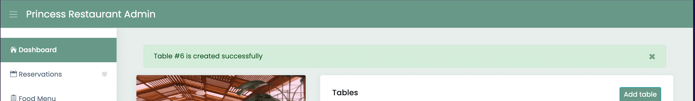
</p>
</details>

<details>
<summary>Update Restaurant</summary>
<p align="center">

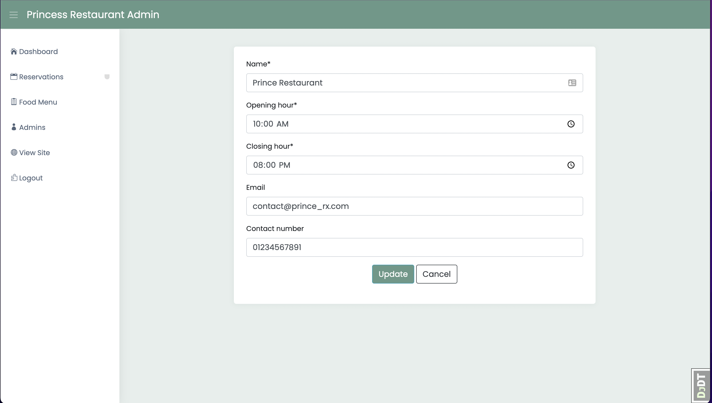
</p>
</details>

### Admin Reservations Page

> Login requied
> User must be admin

*URL: `{host}/reservations/admin/{}/`todays|upcoming|past*

- Admin can manage all reservations on this page.
- Admin can view and cancel todays reservations.
- Admin can view and cancel upcoming reservations.
- Admin can view and cancel past reservations.

<details>
<summary>Reservations (View Reservations page)</summary>
<p align="center">


</p>
</details>

### Admin Food Menu Page

> Login requied
> User must be admin

*URL: `{host}/food-menu/admin/`*

- An admin can manage all the created menu items on this page.
- A page with all the created food menus.
- Admin can update and delete food menu.

<details>
<summary>Admin Food Menu (View Admin Food Menu page)</summary>
<p align="center">

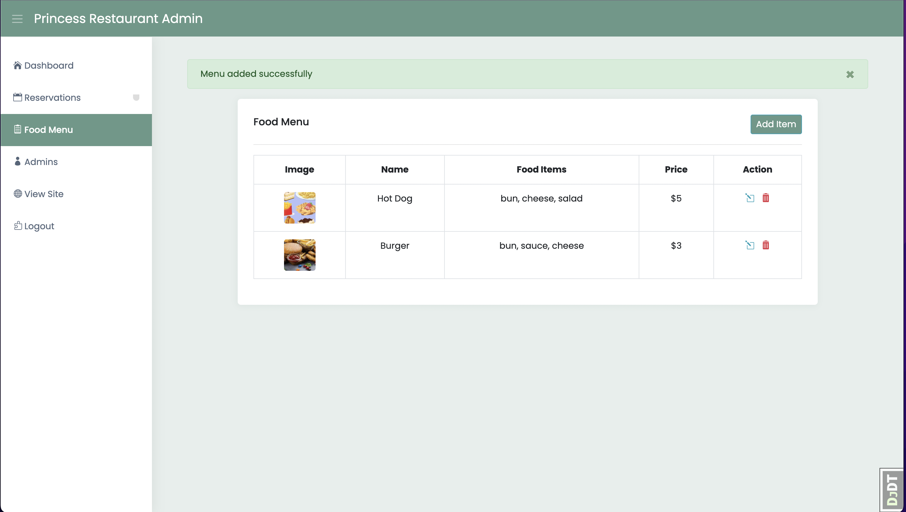
</p>
<summary>Admin Food Menu (View Admin Food Menu page)</summary>
<p align="center">

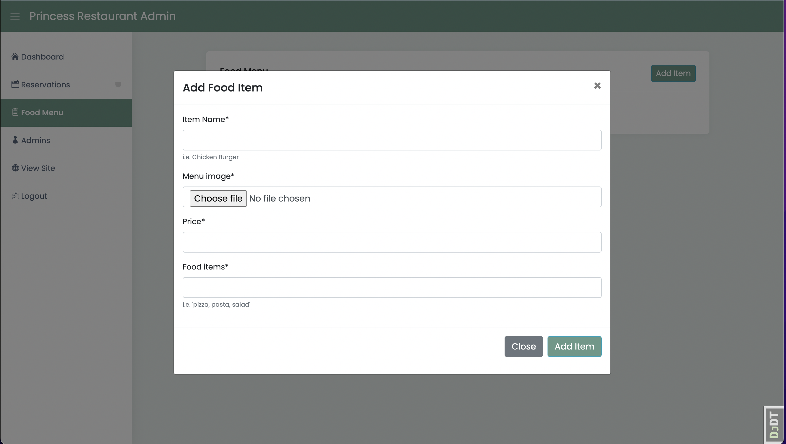
</p>
</details>

### Admins Page

> Login requied
> User must be super_admin

*URL: `{host}/reservations/admin/`*

- Only a super admin can manage restaurant admins.
- Super admin can add, update and delete a restaurant admin.
- Restaurant admin can able to manage the restaurant.

<details>
<summary>Restaurant Admins</summary>
<p align="center">

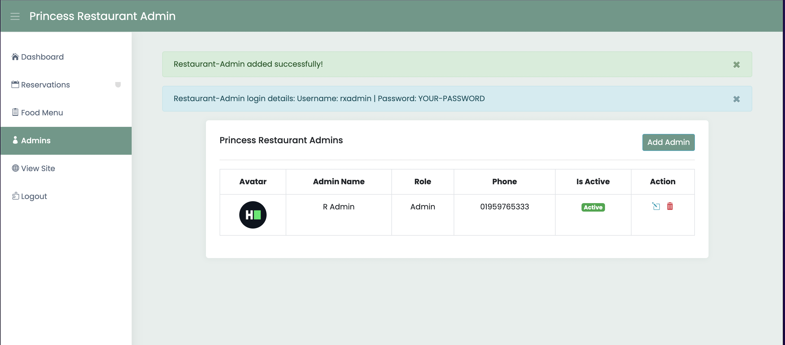
</p>
<summary>Add Restaurant Admin</summary>
<p align="center">

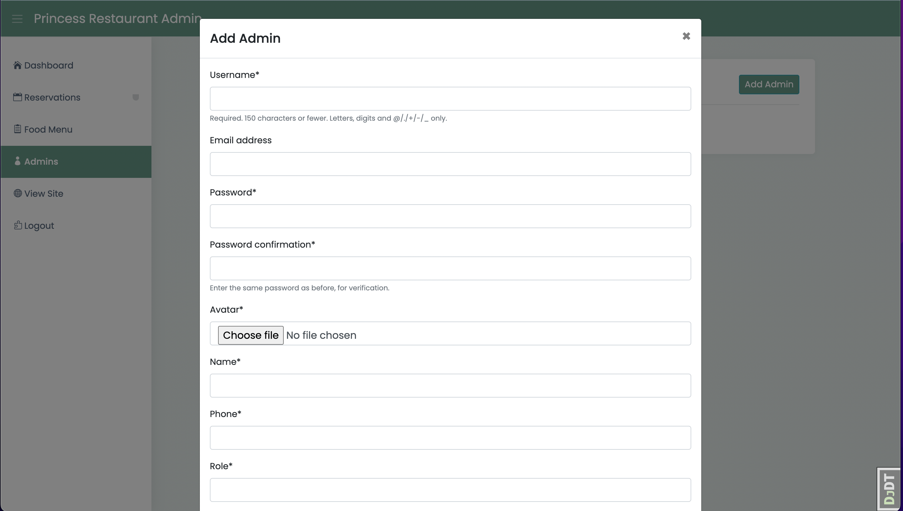
</p>
</details>

### Admins Login Page

> Only super_admin and restaurant admin can login

*URL: `{host}/radmin/login/`*

- This page contains admin login form.
- Successful login will redirect to admin dashboard.

<details>
<summary>Restaurant Admin Login</summary>
<p align="center">

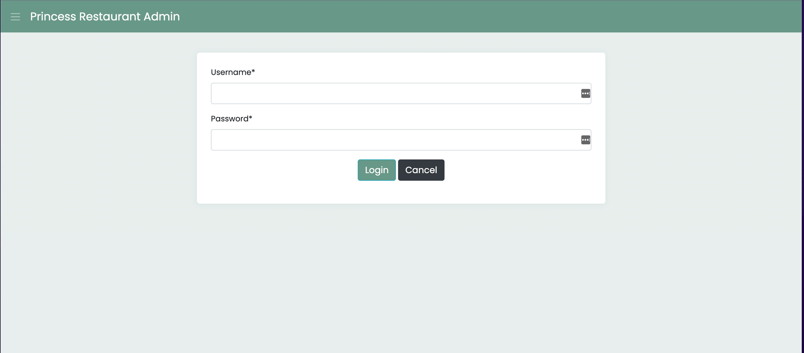
</p>
</details>

## User Stories

### Guest User - user is not logged in

- Can browse the home/index page and view some of the food menus.
- User can send direct messages or contact the restaurant.
- Users can view restaurant information.
- Can browse and view all the food items the restaurant is offering.
- User can signup into the system to become a customer.
  
### Customer - user is logged in

- Signed up user can log in to the system.
- User can make a reservation.
- User can make multiple table reservations.
- User can cancel the upcoming reservation.
- User can view all the pages that a guest user can.
- User can view the successful reservations by making him.
- A user can not make a duplicate reservation.
- A customer can not access the admin dashboard.

### Restaurant Admin - user is logged in as restaurant-admin

- Restaurant-admin can access the radmin-login page.
- Restaurant-admin can access the admin dashboard.
- Admin can manage upcoming reservations.
- Admin can cancel reservations of a customer.
- Admin can delete past reservations.
- Admin can update restaurant information.
- Admin can add, update and delete tables.
- Admin can add, update and delete food menus.

### Super Admin - user is logged in as super-admin

- A super-admin get all the functionalities a restaurant admin has.
- Super admin can add, update and delete restaurant-admin.
- Super admin can manage restaurant admins.
- Super admin can view all the pages.
- Only a super admin has access to admins' management pages.

## Tools & Technologies

#### Languages

- Python
- Javascript
- HTML
- CSS

#### Libraries and Frameworks

- Django
- Django allauth
- Jquery
- Validate.js
- Bootstrap

#### Databases and Storage

- SQLite: Used for local development.
- PostgresSQL: Used for production.

#### Development Tools

- Git: Version controlling.
- Github: Repository hosting.
- Git Pod
- Debug toolbar
- Django extentions
- Pylint
- Flake8
- JSlint
- Prettier
- Neovim
- VS Code
- Iterm2

#### Others

- [Google fonts](http://Fonts.google.com)
- [Jshint.com/](https://jshint.com/) - Used for validation of Javascript code.
- [Validator.w3.org](http://Validator.w3.org)- Used for validation of HTML code.
- [PyGraphviz](https://pygraphviz.github.io/) - Used for generating database schema.
- Google Chrome DevTools - Used for testing website responsiveness.

## Error Handling

Errors are handled during the development process.

- Unit tested each app to handle unexpected errors.
- Manually tested frontend pages to avoid client-side errors.
- Tested templet syntax error to handle template syntax errors.
- Used console to handle known errors.
- Used Chrome DevTools.
  
## Local Development

> ❗Make sure You have python3 and pip installed on your machine.

1. Create a folder where you want to clone the project and cd into it.


> ℹ️ *Optional but better to use a virtual environment for every project.*

If don’t have any virtual environment manager installed in your machine then install one. (I will use pipenv)

For installing pipenv run

```bash
pip install pipenv
```

1. Now clone the project and navigate to BinBlogger-master

```bash
git clone https://github.com/SteveAlsamarae/Restaurant-Booking-APP.git .
```

1. Install all the dependencies for the project.

```bash
pip install -r requirements/local.txt
```

1. Activate the virtual environment

```bash
pipenv shell
```

1. Make sure you are in the project's root directory then run the following command in your terminal.

```bash
python manage.py create_env
```

1. Make sure in `manage.py`, you are using `RestaurantBookingApp.settings.local` for local development and for production use `RestaurantBookingApp.settings.prod`.

1. Now run the following command

```bash
python manage.py makemigrations

python manage.py migrate

python manage.py loaddata
```

1. Now create a superuser

```bash
python manage.py createsuperuser
```

1. If all gone well you can now start the server

```bash
python manage.py runserver
```

